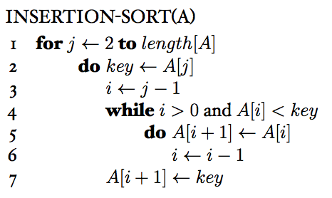

### Exercises 2.1-1
***
Using Figure 2.2 as a model, illustrate the operation of INSERTION-SORT on the array A = [31, 41, 59, 26, 41, 58].

### `Answer`
|0 |1   | 2 | 3 | 4 | 5 |
|--|:--:|--:|--:|--:|--:|
|31| 41 | 59| 26| 41| 58|
|31| 41 | 59| 26| 41| 58|
|31| 41 | 59| 26| 41| 58|
|26| 31 | 41| 59| 41| 58|
|26| 31 | 41| 41| 59| 58|
|26| 31 | 41| 41| 58| 59|

### Exercises 2.1-2
***
Rewrite the INSERTION-SORT procedure to sort into nonincreasing instead of nondecreasing order.

### `Answer`

